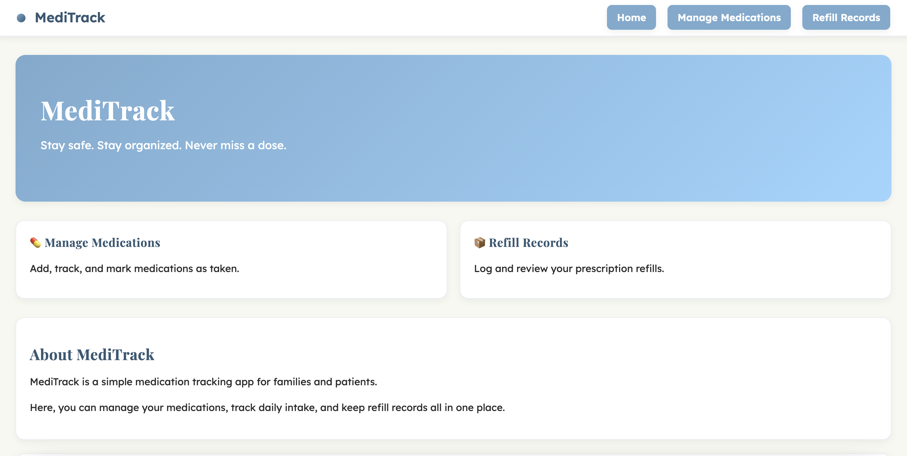
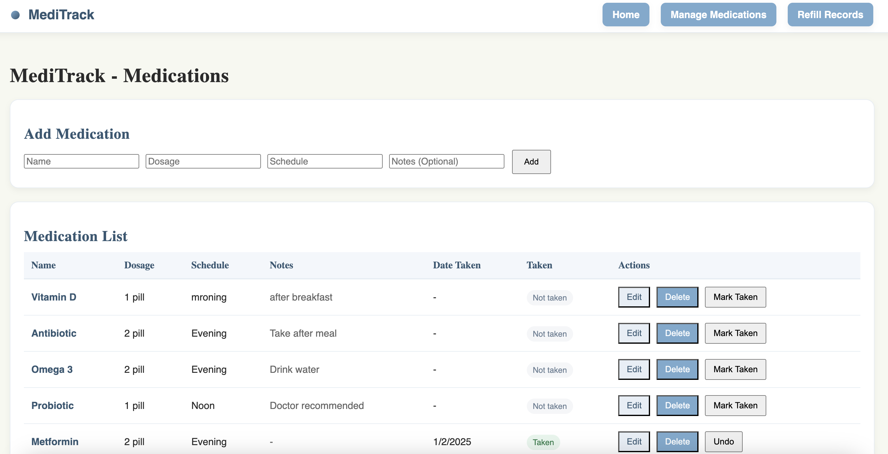
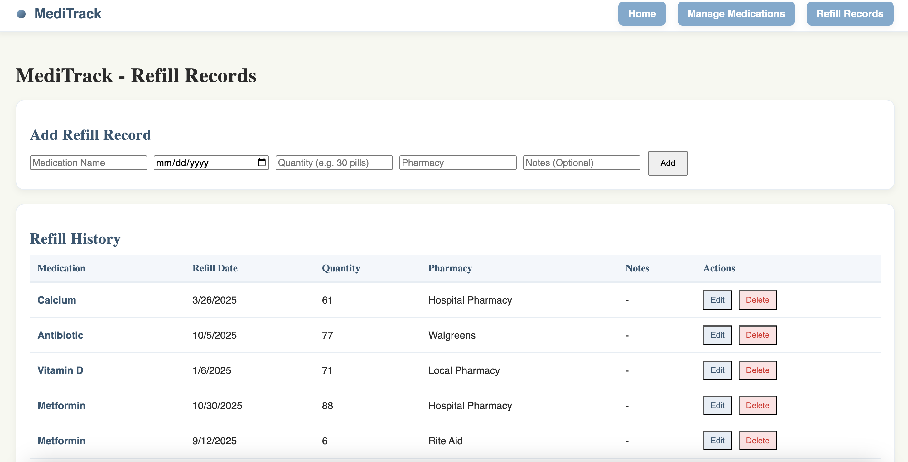

# Project 2 - MediTrack

## Overview
### Author
**Helly Niteshbhai Diyora**
diyora.h@northeastern.edu

**Lili Mei Ye** meiye.l@northeastern.edu

### Class Information
- [CS5610 Web Development](https://johnguerra.co/classes/webDevelopment_online_spring_2026/index.html)
- Spring 2026
- Northeastern University

### Links
- [MediTrack](https://meditrack-80q6.onrender.com/)
- [Design Document](/docs/design-document.pdf)
- [Video Demonstration](https://youtu.be/kZP0StNv1qU?feature=shared)
- [Google Slides](/docs/slides.pdf)

## Project Objective
MediTrack is a simple web application that helps individuals and families manage medications and prescription refills.

The goal of the application is to:
- Keep a clear list of medications
- Track whether medications were taken
- Save refill history
- Help users avoid missed or duplicate doses

This project demonstrates a full-stack application built using:
- Node.js
- Express
- MongoDB
- Vanilla JavaScript
- HTML5 + CSS3

## Features
### Medication Management
- Add medications with dosage, schedule and notes
- Mark medications as taken / undo taken
- Delete medications
- Edit exisiting medications
- View taken date

### Refill Tracking
- Add Refill record with name, refill date, quantity and pharmacy
- Display Record page
- Edit records if there is any changes.
- Delete records no longer needed

## Screenshots

### Homepage

### Medications page

### Refill Records page

## How to Run the Project

## Work Distribution

## License
This project is licensed under the **MIT License**.

See the [MIT License](LICENSE) file for details